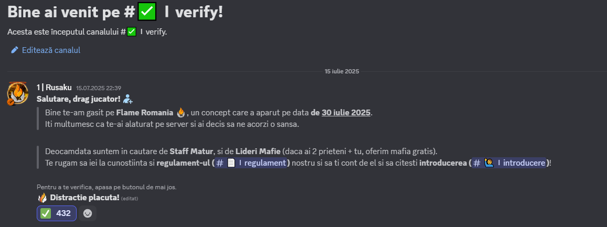

# Autentificare.

***

## <mark style="color:orange;">**De ce ai nevoie ca să te conectezi pe server?**</mark> <a href="#de-ce-ai-nevoie-ca-sa-te-conectezi-pe-server" id="de-ce-ai-nevoie-ca-sa-te-conectezi-pe-server"></a>

* Ai nevoie mai întâi să ai un cont de Discord și să fii pe [<mark style="color:orange;">server-ul nostru de Discord</mark>](https://dsc.gg/flamero1).
* Contul tău de Discord trebuie sa fie verificat cu numărul de telefon.
* Trebuie să ai gradul de **#Flame Member.**

<details>

<summary>Cum obțin Gradul #<strong>Flame Member</strong></summary>

Apasă pe react la emoji-ul cu bifă.

<figure><figcaption></figcaption></figure>

</details>

***

## <mark style="color:orange;">**Link discord cu FiveM.**</mark> <a href="#link-discord-cu-fivem" id="link-discord-cu-fivem"></a>

* Discord-ul trebuie să fie deschis înainte de FiveM.
* Discord-ul NU trebuie sa fie deschis "As Administrator".

<details>

<summary>Cum verific dacă am discord-ul conectat cu FiveM?</summary>

* Intră în FiveM și apasă pe Settings

<figure><figcaption></figcaption></figure>

* Dacă aveți discord-ul conectat, in lista **Linked identities** o să apară iconița discord-ului și username-ul autentificat.

<figure><figcaption></figcaption></figure>

</details>

<details>

<summary>Am un alt cont de discord conectat! Ce fac?</summary>

<mark style="color:orange;">**1. Scrie in start.**</mark>

<figure><figcaption></figcaption></figure>

```
%appdata%
```

<mark style="color:orange;">**2. Apasa enter, ar trebuii sa se deschida un folder.**</mark>\ <mark style="color:orange;">**3. Cauta și șterge folder-ul**</mark><mark style="color:orange;">**&#x20;**</mark><mark style="color:orange;">**`DigitalEntitlements`**</mark>\
<mark style="color:orange;">**4. Deschide discord-ul, conectat la contul dorit.**</mark>\ <mark style="color:orange;">**5. Deschide FiveM.**</mark>


<mark style="color:orange;">**WARNING!**</mark>

* <mark style="color:orange;">**Va trebuii să îți reintroduci datele de conectare la Rockstar Games.**</mark>
* <mark style="color:orange;">**Verifică datele de conectare înainte să faci orice acțiune.**</mark> [<mark style="color:orange;">**https://signin.rockstargames.com/signin/user-form?cid=socialclub**</mark>](https://signin.rockstargames.com/signin/user-form?cid=socialclub)


</details>

***

<mark style="color:orange;">**Va multumim pentru citirea informatiilor despre autentificare, iar daca mai aveti si alte intrebari, asteptam un mesaj pe**</mark> [<mark style="color:orange;">**discord**</mark>](https://dsc.gg/flamero1)<mark style="color:orange;">**. Va asteptam pe server!**</mark>
